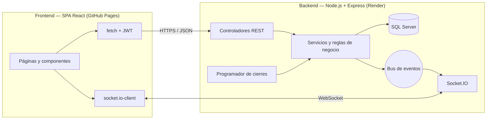
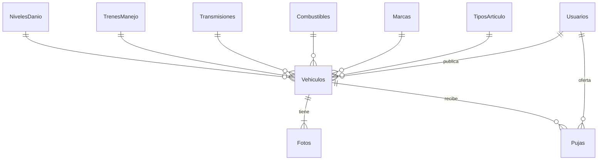

# AutoPuja — Plataforma web de subastas de vehículos en tiempo real

[](https://github.com/EddCastro/autopuja-subastas/actions/workflows/ci.yml)
[](https://github.com/EddCastro/autopuja-subastas/actions/workflows/pages.yml)

## 🔗 Sitio web publicado

### 👉 **https://eddcastro.github.io/autopuja-subastas/**

| Componente | URL |
|---|---|
| **Aplicación web (SPA React)** | **https://eddcastro.github.io/autopuja-subastas/** |
| API REST + WebSocket (Render) | https://autopuja-api-16857.onrender.com/api |
| Estado del servicio | https://autopuja-api-16857.onrender.com/api/health |

> El backend usa el plan gratuito de Render. Si estuvo inactivo, la primera carga puede tardar ~1 minuto (la aplicación muestra un aviso mientras se activa).

## 🔐 Credenciales de prueba

Tres usuarios pre-creados para realizar **pruebas cruzadas de subasta en tiempo real entre varios navegadores** (por ejemplo, Chrome normal + ventana de incógnito + otro navegador). También aparecen en la pantalla de inicio de sesión (sección «Usuarios de prueba»).

| # | Usuario | Correo | Contraseña | Rol sugerido |
|---|---|---|---|---|
| 1 | Ana López | `postor1@autopuja.test` | `Postor1#2026` | Postor |
| 2 | Carlos Méndez | `postor2@autopuja.test` | `Postor2#2026` | Postor |
| 3 | María Rodas | `vendedor@autopuja.test` | `Vendedor#2026` | Publicadora de vehículos |

**Prueba sugerida (2 minutos):** abra el mismo vehículo con el usuario 1 en un navegador y con el usuario 2 en otro. Oferte con el usuario 1: el usuario 2 verá el nuevo monto al instante y el usuario 1 el indicador verde **«¡Vas ganando esta subasta!»**. Oferte con el usuario 2 (+10 %): el usuario 1 verá, sin recargar, el indicador rojo **«Tu oferta ha sido superada. ¡Haz tu oferta ahora antes de que termine el tiempo!»**. Para probar el cierre, publique con el usuario 3 un vehículo con duración de **10 minutos**.

**Autor:** Eddy Adolfo Castro Véliz · Carnet 1890-23-16857 · Universidad Mariano Gálvez de Guatemala

---

## Cumplimiento de la rúbrica

| Serie | Criterio | Implementación |
|---|---|---|
| **S1.1** Git y publicación | Sitio 100 % funcional, README con enlace y 3 usuarios | Frontend en GitHub Pages, API en Render, este README y 3 usuarios pre-creados (semilla `npm run db:semilla`) |
| **S1.2** Autenticación | Login/registro activo; anónimos solo ven catálogo | Registro con nombre, apellido, correo, teléfono y **contraseña segura** (bcrypt); JWT; rutas protegidas en el cliente **y** en el servidor (401): el anónimo solo consulta inventario y detalle |
| **S2.1** Vehículo y galería | Ficha completa, color de daño, carrusel 5+ fotos | Año, tipo, marca, modelo, motor, transmisión, combustible, tren de manejo (AWD/FWD/RWD/4WD) y cilindros; daño 🟢 Verde / 🟡 Amarillo / 🔴 Rojo; galería de **mínimo 5** fotos validadas en el servidor; carrusel con flechas, miniaturas, teclado, deslizamiento táctil y visor ampliado |
| **S2.2** Catálogo y filtros | Home con filtros multitarea | Tarjetas con portada, daño, estado, oferta actual y temporizador; filtros combinables por texto, estado de subasta, daño, marca, modelo, año, precio, tipo, combustible, transmisión, tren de manejo y cilindros (ejecutados en SQL); ordenamiento y paginación; los filtros viajan en la URL |
| **S3.1** Tiempo real | Pujas e indicadores en vivo sin F5; postores anónimos | **Socket.IO (WebSocket)**: la oferta actual, el historial, el temporizador (sincronizado con la hora del servidor) y los indicadores «Ganando» / «Superado» se actualizan al instante en todos los navegadores; notificaciones emergentes en cualquier página; la identidad de los postores nunca se envía |
| **S3.2** Reglas de puja | Validación en servidor, base, > actual, tiempos | Transacción con bloqueo de fila (`UPDLOCK`): primera oferta ≥ monto base; cada nueva puja > oferta actual **y** ≥ +10 %; no se oferta antes del inicio ni después del cierre («Oferta cerrada»); el publicador no puede ofertar por su vehículo; al cierre: **Vendida** o **Desierta** (sin ofertas) |

## Arquitectura (sistema desacoplado)



**Flujo de una puja:** `POST /api/vehiculos/:id/pujas` → transacción SQL que bloquea el vehículo → validación de reglas con la hora del servidor → `INSERT` de la puja y actualización del líder → `COMMIT` → evento `puja:nueva` a **todos** los navegadores (solo monto, cantidad y mínimo siguiente) + evento privado `puja:estado` al nuevo líder («ganando») y al líder anterior («superado»).

## Modelo de datos (SQL Server)



Script de referencia: [`backend/database/esquema.sql`](backend/database/esquema.sql). La API crea automáticamente las tablas y catálogos que falten al iniciar.

## API REST

| Método | Ruta | Acceso | Descripción |
|---|---|---|---|
| POST | `/api/auth/registro` | Público | Crea la cuenta y devuelve el token |
| POST | `/api/auth/login` | Público | Inicia sesión |
| GET | `/api/auth/yo` | Usuario | Perfil de la sesión |
| GET | `/api/catalogos` | Público | Tipos, marcas, combustibles, transmisiones, trenes, niveles de daño, cilindros |
| GET | `/api/catalogos/modelos?marcaId=` | Público | Modelos existentes (autocompletar) |
| GET | `/api/vehiculos` | Público | Inventario con filtros: `q, estado, danio, marca, modelo, anioMin, anioMax, precioMin, precioMax, tipo, combustible, transmision, tren, cilindros, orden, pagina` |
| GET | `/api/vehiculos/:id` | Público | Detalle, fotos y estado de la subasta |
| POST | `/api/vehiculos` | Usuario | Publica (multipart: `datos` JSON + `fotos` ≥ 5) |
| GET | `/api/vehiculos/mios?q=` | Usuario | Buscar mis publicaciones |
| PUT | `/api/vehiculos/:id` | Publicador | Editar mi publicación |
| GET | `/api/vehiculos/:id/pujas` | Público | Historial anónimo de ofertas |
| POST | `/api/vehiculos/:id/pujas` | Usuario | Ofertar `{ "monto": 22000 }` |
| GET | `/api/pujas/mias` | Usuario | Subastas en las que participo |
| GET | `/api/fotos/:id` | Público | Fotografía |

**Eventos en tiempo real (Socket.IO):** `puja:nueva`, `puja:estado` (privado: ganando / superado / ganada / perdida), `subasta:iniciada`, `subasta:cerrada` (vendida / desierta), `vehiculo:nuevo`, `vehiculo:actualizado`, `hora` (sincronización del reloj).

**Errores de puja (422):** `MONTO_MENOR_BASE`, `MONTO_NO_SUPERA_ACTUAL`, `INCREMENTO_INSUFICIENTE`, `SUBASTA_NO_INICIADA`, `SUBASTA_CERRADA`, `PROPIETARIO_NO_PUEDE_OFERTAR`, `YA_ERES_LIDER`.

## Estructura del proyecto

```
autopuja-subastas/
├── backend/                 API REST + Socket.IO (Node.js, Express, mssql)
│   ├── src/
│   │   ├── domain/          Reglas de la subasta (funciones puras)
│   │   ├── services/        Autenticación, vehículos, subastas
│   │   ├── repositories/    SQL Server (y repositorio en memoria para pruebas)
│   │   ├── realtime/        Socket.IO y programador de cierres
│   │   ├── routes/          Controladores/endpoints
│   │   ├── validators/      Validación de datos
│   │   └── db/              Conexión, esquema, migración y semilla
│   ├── tests/               40 pruebas automáticas (reglas, API, tiempo real)
│   └── database/esquema.sql
├── frontend/                SPA React (Vite + React Router)
│   └── src/ (pages, components, context, lib, styles)
├── .github/workflows/       Pruebas (incl. SQL Server 2022 real) y publicación
└── render.yaml              Despliegue del backend
```

## Ejecutar en local

Requisitos: Node.js 20+ y una base de datos SQL Server.

```powershell
# Backend
cd backend
npm install
Copy-Item .env.example .env        # complete DB_* y JWT_SECRET
npm run db:preparar                # crea tablas + 3 usuarios y vehículos de prueba
npm start                          # http://localhost:3000/api

# Frontend (otra terminal)
cd frontend
npm install
npm run dev                        # http://localhost:5173
```

Sin base de datos (datos en memoria, para revisar la interfaz): `cd backend && npm run demo`.

## Pruebas

```powershell
cd backend
npm test
```

Cubren: contraseña segura y login, bloqueo a anónimos, publicación con ficha completa y 5+ fotos, edición solo por el publicador, filtros combinados, **todas las reglas de puja**, pujas simultáneas, privacidad de los postores y los eventos en tiempo real (dos clientes Socket.IO reales). En GitHub Actions se ejecutan además contra **SQL Server 2022** en contenedor.

## Seguridad

- Contraseñas con **bcrypt**; sesiones con **JWT**; credenciales solo en variables de entorno.
- Consultas SQL 100 % parametrizadas; transacciones con bloqueo para las pujas.
- Validación de todos los datos en el servidor (el cliente solo ayuda).
- Las fotos se validan por su firma binaria (JPG/PNG/WEBP) y tamaño.
- `helmet`, CORS restringido, límites de peticiones en login y pujas.

## Créditos

Fotografías de los vehículos de ejemplo: [Pexels](https://www.pexels.com) (licencia libre). Proyecto académico sin fines comerciales.
